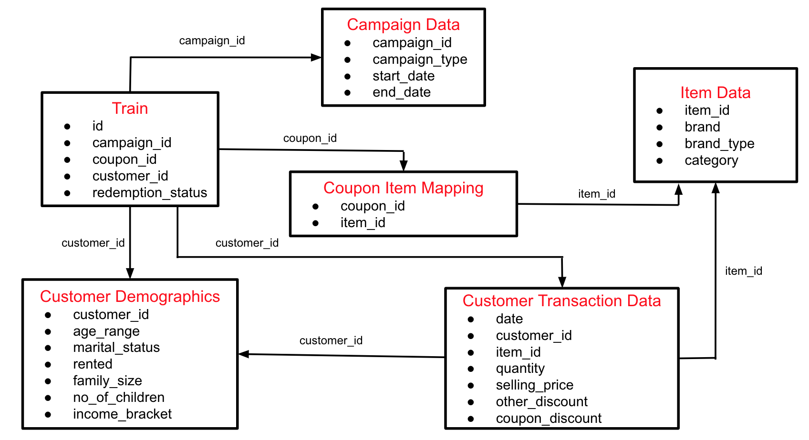

# AM-Expert-Analytics-Vidhya-Hackathon
American Express hackthon hosted on analytics vidhya

## Introduction

American Express and Analytics Vidhya presents “AmExpert 2019 – Machine Learning Hackathon”. An amazing opportunity to showcase your analytical abilities and talent.

Get a taste of the kind of challenges we face here at American Express on day to day basis.

Exciting prizes up for grabs! Best performers also get a chance to get interviewed by American Express for analytics roles!

Don’t hold on to the buzzing ideas in your mind. Just wear your thinking hats and display the spectrum of your creativity!

## Problem Statement

Predicting Coupon Redemption

XYZ Credit Card company regularly helps it’s merchants understand their data better and take key business decisions accurately by providing machine learning and analytics consulting. ABC is an established Brick & Mortar retailer that frequently conducts marketing campaigns for its diverse product range. As a merchant of XYZ, they have sought XYZ to assist them in their discount marketing process using the power of machine learning. Can you wear the AmExpert hat and help out ABC?

Discount marketing and coupon usage are very widely used promotional techniques to attract new customers and to retain & reinforce loyalty of existing customers. The measurement of a consumer’s propensity towards coupon usage and the prediction of the redemption behaviour are crucial parameters in assessing the effectiveness of a marketing campaign.

ABC’s promotions are shared across various channels including email, notifications, etc. A number of these campaigns include coupon discounts that are offered for a specific product/range of products. The retailer would like the ability to predict whether customers redeem the coupons received across channels, which will enable the retailer’s marketing team to accurately design coupon construct, and develop more precise and targeted marketing strategies.

The data available in this problem contains the following information, including the details of a sample of campaigns and coupons used in previous campaigns -

#### User Demographic Details

#### Campaign and coupon Details

#### Product details

#### Previous transactions

Based on previous transaction & performance data from the last 18 campaigns, predict the probability for the next 10 campaigns in the test set for each coupon and customer combination, whether the customer will redeem the coupon or not?
Dataset Description

Here is the schema for the different data tables available. The detailed data dictionary is provided next.

#### Public leaderbord Score 0.8188 AUC-ROC Score 
